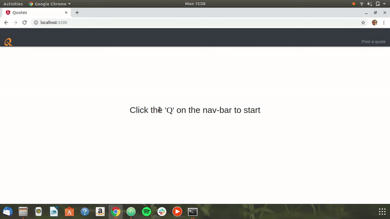

# Quotes-App

This project was generated with [Angular CLI](https://github.com/angular/angular-cli) version 6.1.1.

## By **Nathan Ng'ethe**

## Description
This is an app that allows the user to view various quotes and also add his/her own quotes. The app also gives the user the ability to upvote a quote or downvote it and delete a quote on their side of the server. The details of each quote are the Author's name, the quote itself, and the day it was quoted.

## Setup Instructions
#### Step 1 - Download zip
Download the zip folder or clone the repo.

#### Step 2 - Download the dependencies
To do this run the following:
`$ npm install -g @angular/cli`

#### Step 3 - Running the app
First run:
`$ ng serve`
Then navigate to `http://localhost:4200/` on your browser.

#### Live link
If you don't want to run the app from your local browser you can acces it through the live link:

## Working mechanism
- Go to the 'quotes' page.
- Enter **all** the required details and click on the add      button.
- Your quote is displayed and you can view the quote by clicking the 'show' button.
- You can upvote or downvote a quote by clicking the respective buttons.
- Finally, you can delete a quote from your side of the server.

## Technologies used
* [HTML & CSS](https://www.w3schools.com/html/html_css.asp) - HTML used to create the backbone of the application whereas CSS was used to style the elements.
* [Javascript](https://www.javascript.com/) - This was used to improve user interactivity and to build on the business logic of the project.
* [Typescript](https://www.typescriptlang.org/) - This is a superset of javascript and provided neccessary functions for the building of the application.

## Behaviour Driven Development(BDD)
| Behaviour | Input example    | Output example |
| :------------- | :------------- | :------------- |
| Adding a quote | Fill in fields and click add button  | The quote is appended to the list of quotes |
| Show quote's details | Click 'show' button | The details of the quote appear |
| Upvote/ downvote a quote | Click upvote button/icon | The number of votes increases by one |
| Delete a quote | Click delete button | The specific quote gets deleted |

## Demo

## Known bugs
There was a bug in the forms but is has been fixed. For now there are no known bugs.

## Development server

Run `ng serve` for a dev server. Navigate to `http://localhost:4200/`. The app will automatically reload if you change any of the source files.

## Code scaffolding

Run `ng generate component component-name` to generate a new component. You can also use `ng generate directive|pipe|service|class|guard|interface|enum|module`.

## Build

Run `ng build` to build the project. The build artifacts will be stored in the `dist/` directory. Use the `--prod` flag for a production build.

## Running unit tests

Run `ng test` to execute the unit tests via [Karma](https://karma-runner.github.io).

## Running end-to-end tests

Run `ng e2e` to execute the end-to-end tests via [Protractor](http://www.protractortest.org/).

## LICENSE
The application is under an [MIT License]("https://github.com/lendilai/Quotes-app/blob/master/LICENSE.txt")

## Contact Information
You can contact me via my gmail account:ngethenan768@gmail.com or using my phone number: +254 706446072

## Further help

To get more help on the Angular CLI use `ng help` or go check out the [Angular CLI README](https://github.com/angular/angular-cli/blob/master/README.md).
